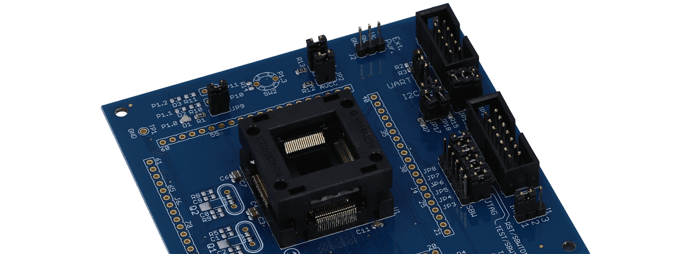

## reference libraries for msp430

this library provides a glue layer between the upstream [Texas Instruments mspdriverlib](https://www.ti.com/tool/MSPDRIVERLIB) and projects that need quick prototyping while also allowing easier code migration from one msp430 microcontroller to another. on one hand it has a number of generic functions and configurable compile-time defines that will set up the hardware abstraction layer allowing the user to focus on the higher level code and on the other hand it can be out-of-the-way and allow direct access to the registers or to the TI driverlib.





```
 source:    https://github.com/rodan/reference_libs_msp430
 author:    Petre Rodan <2b4eda@subdimension.ro>
 license:   BSD
```

### components

* TI MSP430 DriverLib
* HAL glue for
  * default port init
  * system and auxiliary clocks
  * uart with optional interrupt driven tx
  * blocking i2c implementation
  * non-blocking i2c controlled by interrupts
  * bitbanged i2c
  * interrupt-based event handling
  * scheduling (to be added soon)
* drivers
  * *Honeywell High Accuracy Ceramic* (HSC) and *Standard Accuracy Ceramic* (SSC) piezoresistive silicon pressure sensors
  * *Sensirion SHT 1x* humidity and temperature sensors
  * *Maxim DS3231* rtc IC
  * *Maxim DS3234* rtc IC
  * *Analog Devices AD7789* adc IC
  * *Cypress FM24xxx* i2c FRAM IC
  * *Texas Instruments TCA6408* IO expander 
* Makefile-based build, tag file and document generation, code static scan
* shell scripts for checking the build environment, flashing uCs, version incrementation, RTC initialization
* a Makefile driven collection of unit tests for the drivers above

### software requirements

the entire development is done on a Gentoo Linux using makefiles, vim, the TI toolchain and gdb.
while none of those are a requirement to making the library part of any msp430 project, it happens to be the beaten road. the library can be used in the following ways:

#### via a special project makefile (in a linux environment)

see [this Makefile](https://github.com/rodan/sigdup/blob/master/firmware/Makefile) for the perfect example. **REFLIB_ROOT** defines the path to where this reference library has been cloned, **TARGET** represents the target microcontroller and [config.h](https://github.com/rodan/sigdup/blob/master/firmware/config.h) will be automatically expanded into compilation macros (-DFOO arguments to be sent to gcc). if **TARGET** is not hardcoded in the Makefile, then the user needs to provide it as an argument to make:

```
make TARGET=MSP430FXXXX
```

the makefile supports the following options:

```
# check if everything is installed and paths are correct
make envcheck

# remove the build/DEVICE/ directory
make TARGET=MSP430FXXXX clean

# compile the project and library
# create dependency tree and source code tags
make TARGET=MSP430FXXXX

# burn the firmware onto the target microcontroller
make TARGET=MSP430FXXXX install

# perform an optional static scan of the source code 
make TARGET=MSP430FXXXX cppcheck    # needs dev-util/cppcheck
make TARGET=MSP430FXXXX scan-build  # needs sys-devel/clang +static-analyzer
```

in order to use gdb to debug the project make sure to enable the **CONFIG_DEBUG** macro in config.h and run in a terminal

```
LD_PRELOAD='/opt/reference_libs_msp430/lib/libmsp430.so' mspdebug --allow-fw-update tilib gdb
```

and then start gdb from within the project directory:

```
make debug
```

commonly used commands from within gdb provided as example for the unit tests:

```
target remote localhost:2000
monitor reset
monitor erase
load build/MSP430FR5994/main.elf
b
disassemble
nexti
info registers
continue
tui enable
```

the included [Makefile.env](https://github.com/rodan/reference_libs_msp430/blob/master/Makefile.env) contains the paths for the excelent [TI msp430 toolchain](https://www.ti.com/tool/MSP430-GCC-OPENSOURCE) which is a requirement in this scenario. a [shell script](./tools/check_setup.sh) for checking the build environment can be run on a non-priviledged account and will provide pointers of what packages are needed for building using this library. it also helps in installing the TI toolchain and support files.

all the [unit tests](https://github.com/rodan/reference_libs_msp430/tree/master/tests) can be compiled with this method.

#### via *Code Composer Studio for Linux*

import [this project](https://github.com/rodan/sigdup/tree/master/firmware) as an example. the reference library is expected to be symlinked or cloned into */opt/reference_libs_msp430/* while the compilation macros, the memory model, compile includes are all baked into the project's xml files - one needs to tweak them via *project properties* since this scenario is not using any of the provided Makefiles or scripts. compiling and debug is done via CCS.

#### via *Code Composer Studio for Windows*

theoretically like above, but I have never tested it.

### support

tests of the library are performed on the following target devices:

microcontroller | family       |clock|uart | i2c | spi | scheduling
--------------- | ------------ | --- | --- | --- | --- | ----------
CC430F5137   | MSP430F5xx_6xx  | [ ] | [ ] | [ ] | [ ] | [ ]
MSP430F5438  | MSP430F5xx_6xx  | [ ] | [ ] | [ ] | [ ] | [ ]
MSP430F5510  | MSP430F5xx_6xx  | [x] | [x] | [x] | [x] | [ ]
MSP430F5529  | MSP430F5xx_6xx  | [ ] | [ ] | [ ] | [ ] | [ ]
MSP430FR2355 | MSP430FR2xx_4xx | [x] | [ ] | [ ] | [ ] | [ ]
MSP430FR2433 | MSP430FR2xx_4xx | [x] | [ ] | [ ] | [ ] | [ ]
MSP430FR2476 | MSP430FR2xx_4xx | [x] | [ ] | [ ] | [ ] | [ ]
MSP430FR4113 | MSP430FR2xx_4xx | [ ] | [ ] | [ ] | [ ] | [ ]
MSP430FR5994 | MSP430FR5xx_6xx | [x] | [x] | [x] | [x] | [ ]
MSP430FR6989 | MSP430FR5xx_6xx | [ ] | [ ] | [ ] | [ ] | [ ]

this list covers microcontrollers I have on hand. adding support for new ones is entirely possible and is mostly limited by devboard availability.
in most cases adding the new device to [Makefile.identify-target](https://github.com/rodan/reference_libs_msp430/blob/master/Makefile.identify-target) is enough to get things started. patches are welcome.

### references 

the following projects are already using this library:

project | microcontroller | short description
------- | --------------- | -----------------
[sigdup](https://github.com/rodan/sigdup) | msp430fr5994 | software that takes PulseView digital signal captures as input and re-plays them
[solar-charger rev4.1](https://github.com/rodan/solar-charger) | msp430f5510 | off-the-grid 1 cell lipo and 12v lead battery charger for low efficiency 15-36V photovoltaic cells


